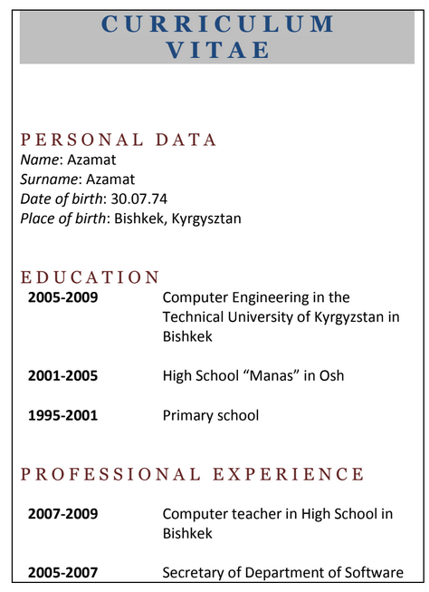
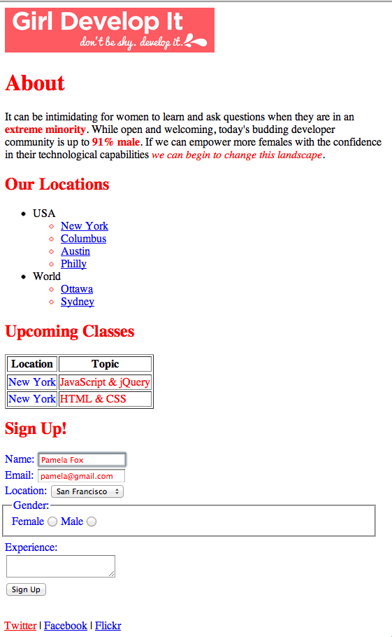

# EJERCICIO 1: (ej1.html y ej1.css)

Dada la siguiente tabla:

Añadir los estilos en el fichero ej1.css para que las filas pares y las impares tengan diferente color de fondo (even - odd)
El borde de las filas de la tabla sólo debe ser el inferior. Dale el tamaño que desees.
Añadir una cabecera a la tabla que tenga un color de fondo negro y un color de letra blanco. (Deberás modificar ligeramente el HTML).
Hacer que cuando paso el ratón por las filas cambie su color de fondo y el color de su texto.

```javascript
<table>
      <tr><td>Pepe</td><td>@pepeman</td><td>111-222</td></tr>
      <tr><td>Manuel</td><td>@manuelman</td><td>333-4444</td></tr>
      <tr><td>Lola</td><td>@lolaman</td><td>555-6666</td></tr>
      <tr><td>Sara</td><td>@saraman</td><td>777-8888</td></tr>
 </table>
 ```
 
# EJERCICIO 2: (ej2.html, ej2.css)

Realiza el HTML y CSS necesario para conseguir una página similar a la siguiente:



Fuente: http://desarrolloweb.dlsi.ua.es/cursos/2011/html5-css3/css-exercises

# EJERCICIO 3: (ej3.html y ej3.css)


Añadir los estilos para conseguir la siguiente imagen:



