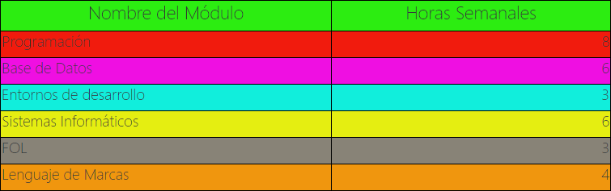

## U7_1920_Estructura_de_Control_y_Funciones
Continuando con vuestra página del CV debéis hacer lo siguiente:
* Añadir a la página una sección nueva que se llame "Módulos de 1º DAW" . En esa sección deberéis incluir una tabla con dos columnas (nombre del módulo y horas semanales). Utilizando una estructura repetitiva Sass en archivo .scss dotad de color de fondo distinto a cada una de las filas de la tabla. Los colores deben estar recogidos en una lista Sass.

Un ejemplo de posible resultado de la sección

* Utilizando una estructura repetitiva Sass (diferente a la anterior) en el archivo .scss generar automáticamente unos nuevos estilos para las etiquetas h1-h6 estableciendo unos tamaños de letras diferentes a los tamaños que establecen los navegadores por defecto. Tu página deberá contener alguna ocurrencia de dichas etiquetas.
* Crear una función calcularAnchura() en tu arhivo .scss (con los parámetros que estimes oportunos) y usadla para indicar las anchuras de los elementos principales en los distintos breakpoints.
* Utilizando estructuras condicionales en el fichero .scss generar dos versiones de la página (tema-claro y tema-oscuro) que cambie los colores generales de la página atendiendo al valor de una variable. Deberéis crear un documento que explique el proceso para que el profesor pueda generar automáticamente las dos versiones. Entregad en carpetas separadas (claro y oscuro)  las dos versiones ya generadas

**NOTA: Debéis entregar el achivo .scss y las dos versiones generadas (separadas por carpetas y conteniendo todos los elementos necesarios en cada carpeta)**

**NOTA: Podéis seguir mejorando la página incluyendo apartados y elementos nuevos.**